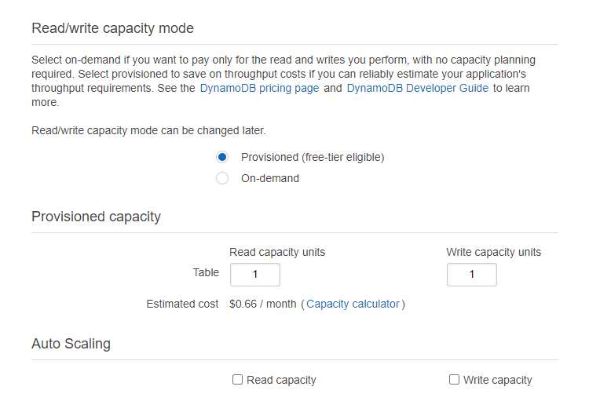

# TwitchDev-Tutorial-EventSub
Tutorial for implementing Twitch EventSub using serverless infrastructure. 

## Overview
Serverless solutions such as those offered by AWS, Google Cloud, Microsoft Azure, and others, are a cost effective method of integrating with Twitch EventSub. Unlike traditional hosted, or virtualized, servers which often have a monthly or yearly rental which is applied regardless of if the server is utilized or not, Serverless solutions such as API Gateway, Lambda, and DynamoDB charge based on usage and can scale up and down as needed so you will not be paying for unused capacity.

This tutorial is intended as a basic introduction to how these services can be used with EventSub, and depending on your needs they may or may not be suitable in a production environment.

The goal is to have an internet accessible callback URL for Twitch to send notifications to, 2 Lambda functions (1 for subscribing, unsubscribing, and returning status data, and 1 function for handling incoming notifications), and a DyanmoDB database to store notifications. While the creation of this setup could be entirely automated, this hands-on tutorial should lead to a greater understanding of the underlying services involved.


## Prerequisites
* Registered an app on the [Twitch Developer Console](https://dev.twitch.tv/console), and made note of the Client ID and Client Secret.
* Registered an account with [Amazon Web Services (AWS)](https://aws.amazon.com/).


## Services
* API Gateway - Provides a publicly accessible callback URL, over HTTPS, for Twitch to send notifications to.
* Lambda - Stateless functions that will handle EventSub subscription requests, and handling incoming verification/notification messages from Twitch.
* DynamoDB - Document database for storing notifications, with the option for new/updated items to trigger other services/functions.


# Step 1: DynamoDB table
1. Go to the [DynamoDB console](https://console.aws.amazon.com/dynamodb), click `Create Table`.
2. Enter a name for the table, and enter `id` as the Primary key.
3. Disable `Use default settings`, Disable Read/Write capacity auto scaling, set the provisioned capacity to 1 Read and 1 Write capacity unit.
4. Click `Create`. Once the table is created scroll down and make note of the `Amazon Resource Name (ARN)`.





# Step 2: IAM role
1. Go to the [IAM console](https://console.aws.amazon.com/iam), select `Roles` under the `Access management` section, then `Create role`.
2. Select `Lambda` as the use case, click `Next: Permissions`, search for and select the `AWSLambdaBasicExecutionRole` policy.
3. Continue through the next steps, give the role a name and make note of it and finish the role creation.
4. Select the newly created role and click `Add inline policy`.
5. Select DynamoDB, add the Write permission `PutItem`, in the resources section add the ARN of the previously created DynamoDB table.
6. Review, name, and save the policy.


# Step 3: Lambda functions
1. Go to the [Lambda console](https://console.aws.amazon.com/lambda), click `Create function`.
2. Name the Subscriptions handler function, such as `TwitchDev-Tutorial-EventSub-Subscriptions`, select `Node.js 12.x` runtime, change default execution role and using an existing role select the IAM role created in the previous step, then click `Create function`.
3. Under the `Actions` dropdown menu, select upload .zip and select the `Subscriptions.zip` file included in this repo.
4. In the `Environment variables` section, create keys for `clientID` and `clientSecret` which will be the client id and secret from your app on Twitch, `eventSubSecret` variable which you create yourself, and we'll also come back later to add a `callback` variable once we've created our API Gateway. Click `Deploy`.
5. Follow the previous steps to create a function for `Notifications`, this time with the `eventSubSecret` variable again, and the variables `region` which is your AWS region your DynamoDB table is in, such as `eu-west-1`, and a `tableName` variable which will be the name of your DynamoDB table. 


# Step 4: API Gateway
1. Go to [API Gateway Console](https://console.aws.amazon.com/apigateway), click `Create API`.
2. Select `REST API` (make sure NOT to select the private REST API option), choose a name, optionally a description, and click `Create API`.
3. From the `Actions` dropdown, select `Create Resource` and name it `notifications`. Then select `Create Method` and set it to `POST`.
4. Select `Use Lambda Proxy integration` and type in the name of your notifications Lambda function create earlier and click save.
5. Select `Deploy API` from the `Actions` menu, name the deployment stage DEV, and copy the `Invoke URL`.

# Step 5: Test!
1. Go to the [Lambda console](https://console.aws.amazon.com/lambda) and select the `Subscriptions` function that was created.
2. Add an Environment variable named `callback` with the value being your `Invoke URL` with `/notifications` on the end of it, eg `https://1234.execute-api.eu-west-1.amazonaws.com/DEV/notifications`.
3. Deploy the changes.
4. In the `Select a test event` dropdown in the top right, select `Configure test events`, create the 3 following events:

Event Name: `Subscribe`
```JSON
  {
    "type": "subscribe"
  }
```

Event Name: `Status`
```JSON
  {
    "type": "status"
  }
```

Event Name: `Unsubscribe`
```JSON
  {
    "type": "unsubscribe",
    "id": ""
  }
```

5. To test run the `Subscribe` test event which should show successfully executing the Lambda function. To ensure the EventSub subscription is established run the `Status` test and the log should return that there is 1 subscription that is enabled (if it is showing as pending, wait a moment and check the status again). To test that an enabled subscription is saving notifications to DynamoDB you can trigger the topic, which in this example would be to follow my [Twitch Channel](https://twitch.tv/thedist) and check your DynamoDB table to see if there is a new item. Once finished with testing, copy the ID of the EventSub subscription given by the `Status` test, paste that into the `Unsubscribe` test and run that to unsubscribe.

